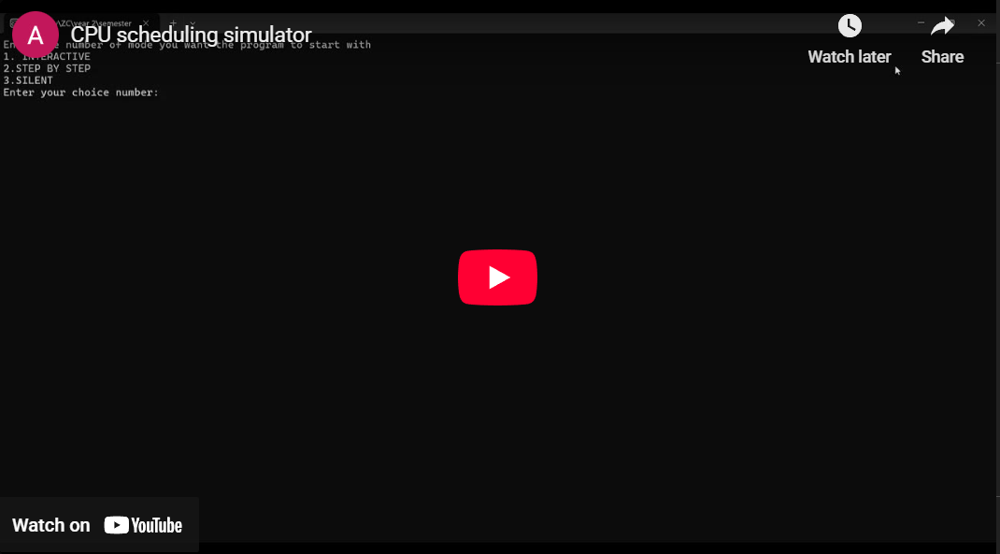
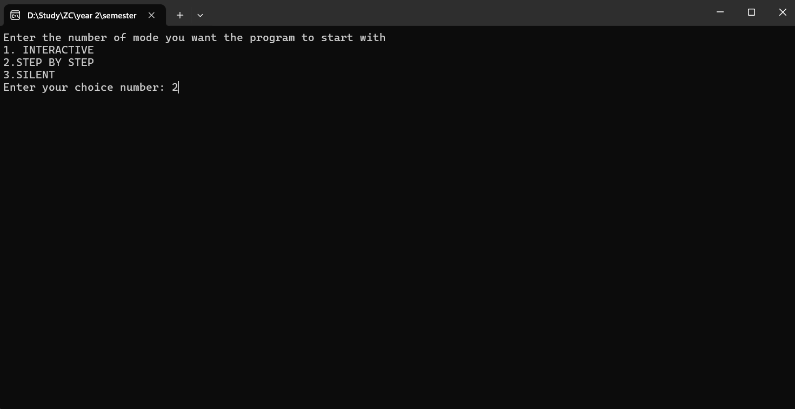
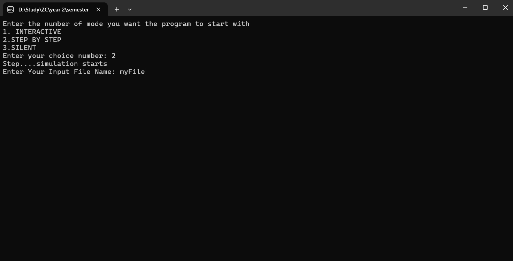

# CPU Scheduling Simulator 🖥️⚡

A comprehensive C++ implementation of various CPU scheduling algorithms with multiple execution modes. Built with custom data structures and designed for educational purposes to demonstrate process scheduling concepts.

[](https://www.youtube.com/embed/GCb-va1WDiY?si=0nH1pRuWhRNlPFNE)

## 📋 Description

This CPU Scheduling Simulator implements multiple scheduling algorithms to manage process execution in a simulated multi-processor environment. The program demonstrates key operating system concepts including process states, I/O operations, and inter-processor load balancing.

The project showcases advanced C++ concepts including templates, inheritance, polymorphism, and custom data structure implementations.

<br>
<br>
<div align="center">
  <a href="https://github.com/TendoPain18/cpu-scheduling-simulator/raw/main/Release/cpu-scheduling-simulator.rar">
    
  </a>
</div>

## ✨ Features

### Scheduling Algorithms

- **FCFS (First-Come-First-Served)**: Processes are executed in the order they arrive
- **SJF (Shortest Job First)**: Priority given to processes with shortest CPU time
- **RR (Round Robin)**: Time-sliced execution with configurable quantum
- **EDF (Earliest Deadline First)**: Priority-based scheduling for real-time processes

### Process Management

- **Process States**: NEW, READY, RUNNING, BLOCKED, TERMINATED
- **I/O Operations**: Simulated I/O requests and blocking periods
- **Process Migration**: Dynamic migration between processors based on load
- **Kill Signals**: Support for process termination via SIGKILL
- **Process Forking**: Parent-child process relationships

### Advanced Features

- **Multi-Processor Support**: Configurable number of processors per algorithm
- **Load Balancing**: Work-stealing mechanism to balance processor loads
- **Statistics Tracking**: 
  - Response Time
  - Turnaround Time
  - Waiting Time
  - CPU Utilization
- **Three Execution Modes**:
  - Interactive Mode (manual step-through)
  - Step-by-Step Mode (automatic with 1-second delay)
  - Silent Mode (fast execution, output only)

## 🚀 Getting Started

### Prerequisites

- Microsoft Visual Studio (2017 or later)
- Windows OS
- C++11 or higher

### Installation

1. Clone the repository
```bash
git clone https://github.com/TendoPain18/cpu-scheduling-simulation.git
```

2. Open the solution file
```
CIE_205_Project.sln
```

3. Build the project in Visual Studio
   - Select Build → Build Solution (or press Ctrl+Shift+B)

4. Run the application
   - Press F5 or click Start Debugging

## 📖 Usage

### Running the Simulator

<br>
<div align="center">
  
  
</div>

<br>

1. **Select Execution Mode**
   - Enter `1` for Interactive Mode
   - Enter `2` for Step-by-Step Mode
   - Enter `3` for Silent Mode

2. **Load Input File**
   - Enter the filename (e.g., `myFile.txt`)
   - Sample files are provided in the `Sample/` directory

3. **View Simulation**
   - Watch processes move through different states
   - Monitor processor queues and statistics
   - Press any key to advance (Interactive mode)

### Input File Format
```
[FCFS] [SJF] [RR] [EDF]              # Number of each processor type
[RR_TimeSlice]                        # Time quantum for Round Robin
[RTF] [MaxW] [STL] [Fork_Prob]       # Constants (Response Time Factor, Max Wait, Steal Limit, Fork Probability)
[Number_of_Processes]                 # Total processes
[AT] [PID] [CT] [N] [(IO_R,IO_D)]... # Process details (Arrival Time, Process ID, CPU Time, I/O Count, I/O pairs)
...
[KillTime] [PID]                      # Kill signals (optional)
```

**Example:**
```
8 0 0 0
2
4 20 100 10
20
0 1 2 2
0 2 20 2
5 4 40 2 (5,20)
```

## 📁 Project Structure
```
cpu-scheduling-simulation/
├── CIE_205_Project/
│   ├── main.cpp                    # Entry point
│   ├── Data_Structures/            # Custom data structures
│   │   ├── Array.h
│   │   ├── LinkedList.h
│   │   ├── LinkedQueue.h
│   │   ├── Priority_Queue.h
│   │   ├── HashTable.h
│   │   └── SharedClasses/
│   │       ├── Node.h
│   │       ├── MaxHeap.h
│   │       ├── Pair.h
│   │       └── QueueADT.h
│   ├── Process/
│   │   └── Process.h               # Process class
│   ├── Processors/
│   │   ├── Processor.h             # Base processor class
│   │   ├── FCFS_Processor.h
│   │   ├── SJF_Processor.h
│   │   ├── RR_Processor.h
│   │   └── EDF_Processor.h
│   ├── Scheduler/
│   │   ├── scheduler.h             # Main scheduler
│   │   └── scheduler.cpp
│   └── UI/
│       ├── UI.h                    # User interface
│       ├── UI.cpp
│       └── Mode.h                  # Execution modes
├── Sample/
│   ├── myFile.txt                  # Sample input files
│   ├── myFile2.txt
│   ├── myFile3.txt
│   └── myFile4.txt
└── x64/Release/
    └── CIE_205_Project.exe         # Compiled executable
```

## 🏗️ Architecture

### Class Hierarchy

**Processor Hierarchy:**
- `Processor` (Abstract Base Class)
  - `FCFS_Processor`
  - `SJF_Processor`
  - `RR_Processor`
  - `EDF_Processor`

**Data Structures:**
- Template-based implementations
- `Array<T>`: Dynamic array with bounds checking
- `LinkedList<T>`: Doubly-linked list
- `LinkedQueue<T>`: Queue using linked nodes
- `Priority_Queue<T>`: Max-heap based priority queue
- `HashTable`: Hash table for O(1) process lookup

**Key Components:**
- `Scheduler`: Manages all processors and process states
- `Process`: Encapsulates process attributes and statistics
- `UI`: Handles user interaction and display

## 🎯 Key Concepts Demonstrated

- **Process Scheduling**: Multiple scheduling algorithms
- **Data Structures**: Custom implementations from scratch
- **Object-Oriented Design**: Inheritance, polymorphism, encapsulation
- **Memory Management**: Dynamic allocation and proper cleanup
- **File I/O**: Reading configuration and writing statistics
- **Templates**: Generic programming for reusable data structures

## 🛠️ Built With

- **Language**: C++
- **IDE**: Microsoft Visual Studio
- **Design Patterns**: 
  - Strategy Pattern (for scheduling algorithms)
  - Template Method Pattern
  - Factory Pattern (for processor creation)

## 📊 Output

The simulator provides real-time output showing:
- Current time step
- NEW processes waiting to arrive
- READY processes in each processor queue
- RUNNING processes on each processor
- BLOCKED processes waiting for I/O
- TERMINATED processes with statistics

## 🤝 Contributing

Contributions are welcome! Feel free to:
- Add new scheduling algorithms
- Improve existing implementations
- Enhance visualization
- Add more test cases
- Optimize performance

Please open an issue first to discuss what you would like to change.

## 📄 License

This project is licensed under the MIT License - see the [LICENSE](LICENSE) file for details.

## 🙏 Acknowledgments

- Inspired by operating system concepts and CPU scheduling theory
- Built as part of CIE 205 (Data Structures and Algorithms) course project
- Implements concepts from modern operating systems textbooks

<br>
<div align="center">
  <a href="https://github.com/TendoPain18/cpu-scheduling-simulator/raw/main/Release/cpu-scheduling-simulator.rar">
    
  </a>
</div>


## <!-- CONTACT -->

<div id="toc" align="center">
  <ul style="list-style: none">
    <summary>
      <h2 align="center">
        🚀 CONTACT ME 🚀
      </h2>
    </summary>
  </ul>
</div>

<table align="center" style="width: 100%; max-width: 600px;">
  <tr>
    <td style="width: 20%; text-align: center;">
      <a href="https://www.linkedin.com/in/amr-ashraf-86457134a/" target="_blank">
        
      </a>
    </td>
    <td style="width: 20%; text-align: center;">
      <a href="https://github.com/TendoPain18" target="_blank">
        
      </a>
    </td>
    <td style="width: 20%; text-align: center;">
      <a href="mailto:amrgadalla01@gmail.com">
        
      </a>
    </td>
    <td style="width: 20%; text-align: center;">
      <a href="https://www.facebook.com/amr.ashraf.7311/" target="_blank">
        
      </a>
    </td>
    <td style="width: 20%; text-align: center;">
      <a href="https://wa.me/201019702121" target="_blank">
        
      </a>
    </td>
  </tr>
</table>

<!-- END CONTACT -->

## **Experience the power of process scheduling! ⚡✨**
